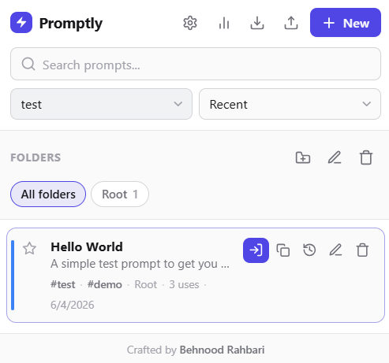

# Promptly

Promptly is a Chrome extension for saving, searching, copying, and inserting reusable AI prompts directly into supported chat sites. Prompts are stored locally with Chrome extension storage.

## Download And Install

Promptly is currently installed as an unpacked Chrome extension.

1. Open this GitHub repository in your browser.
2. Click the green `Code` button.
3. Click `Download ZIP`.
4. Unzip the downloaded file.
5. Open Chrome and go to `chrome://extensions`.
6. Enable `Developer mode` in the top-right corner.
7. Click `Load unpacked`.
8. Select the unzipped Promptly folder that contains `manifest.json`.
9. Pin Promptly from the Chrome extensions menu.

To update Promptly later, download the newest ZIP, unzip it, replace the old folder, then return to `chrome://extensions` and click the extension's reload button.

## Features

- Save prompts with titles, summaries, tags, and colors.
- Search prompts with fuzzy matching, keyboard navigation, tags, folders, and sort modes.
- Insert prompts into supported AI chat inputs from the popup.
- Expand prompts inline with a slash-command trigger on supported AI chat sites.
- Fill `{{variable}}` and `{{variable|default}}` template fields before insert or copy.
- Copy prompts to the clipboard.
- Mark favorites and sort by recency, usage, A-Z, or favorites first.
- Restore prior prompt versions from local history.
- Sync small settings like theme, locale, and slash-trigger preferences with Chrome sync.
- Import and export prompt libraries as JSON.
- Use a context menu entry from editable fields.
- View local-only usage stats.

## Supported Sites

- ChatGPT: `https://chatgpt.com/*`
- Legacy ChatGPT: `https://chat.openai.com/*`
- Claude: `https://claude.ai/*`
- Gemini: `https://gemini.google.com/*`
- Google AI Studio: `https://aistudio.google.com/*`
- Grok: `https://grok.com/*`
- DeepSeek: `https://chat.deepseek.com/*`

## Permissions

Promptly uses:

- `activeTab` and `scripting` to insert a selected prompt into the current tab after user action.
- `storage` to keep prompts locally.
- `clipboardWrite` for copy actions.
- `contextMenus` for the editable-field context menu.

Host access is limited to the supported AI chat domains listed above.

## Privacy

Promptly stores prompt data locally in the browser. Settings sync is opt-in and only stores small preferences in Chrome sync; prompt bodies and history remain local.
